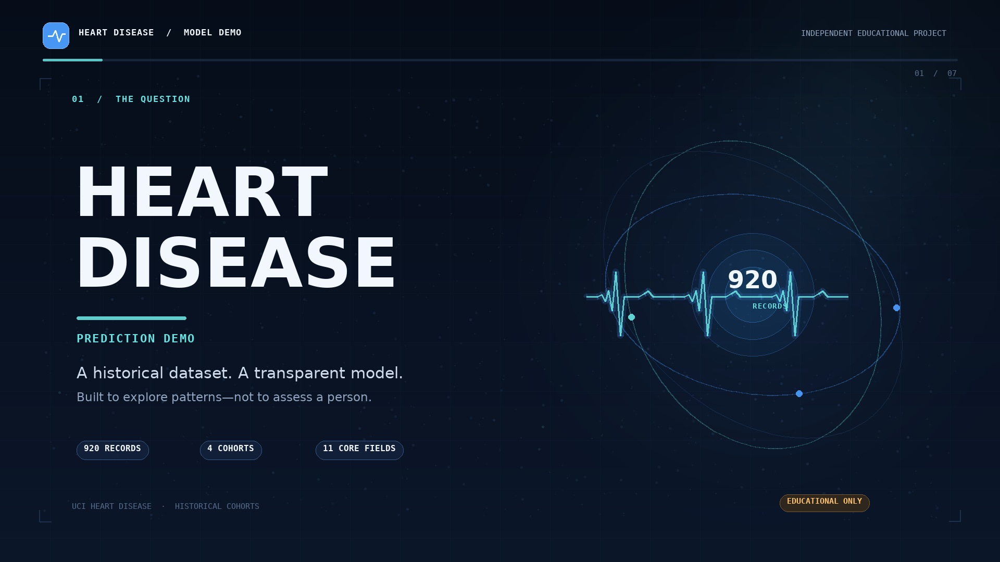

# Heart Disease Prediction — Educational ML Demo

A reproducible, small-scope project inspired by the workflow shown in the Instagram reel: inspect data, clean and preprocess it, compare classifiers, evaluate them, and present a Streamlit demo. This is an independent implementation; the reel's exact source code was not available.

> **Important:** this is a learning/demo project, not a medical device. It is not clinically validated and must not be used to diagnose, screen or make treatment decisions. Do not enter real health or identifying information.

## What it does

- Downloads the official UCI Heart Disease processed files and combines the four source cohorts into a 920-row CSV.
- Maps the original `num` outcome to a binary label: `0` vs. `num > 0`.
- Compares two input sets: 11 core fields and all 13 clinical fields. The latter adds `ca` and `thal`, which are substantially missing in the merged data.
- Trains Logistic Regression, Random Forest and XGBoost pipelines. Imputation, encoding and scaling are fit within the CV/training pipeline to reduce leakage.
- Uses grouped cross-validation by source cohort for model selection, plus a separate stratified patient-level test split for a final report.
- Provides an editorial, accessible Streamlit experience with fictional presets, plain-language field help, an evaluation summary and a data audit path.
- Does **not** persist user inputs or prediction history in the app. A hosting provider may retain operational logs under its own policies; visitors should use fictional values only.

## Public-friendly UI

The app opens directly on the fictional example tool, then continues into model evaluation and data limitations in one scrollable reading path. Inputs are grouped and bounded to observed source-data values, with field-level help, and the model output updates live as values change. Two fictional presets sit on clearly opposite sides of the cutoff (one strong negative, one strong positive) so the meaning of the label is obvious; neither preset is presented as a typical health state. Results are labelled as source-data classes, not a diagnosis. Semantic comparison and audit tables preserve exact metrics; the full candidate CSV is downloadable.

The visual direction (2026-10 refresh) is a self-contained **white-primary / blue-secondary** theme inspired by the [UI/UX Pro Max skill](https://github.com/nextlevelbuilder/ui-ux-pro-max-skill) and the [React Bits](https://reactbits.dev) aesthetic (soft aurora glow, faint dot-grid hero, gentle micro-interactions), implemented with page-owned CSS only. No third-party JavaScript, component libraries, or copied code are used. Inter (with a system-sans fallback) and JetBrains Mono load from Google Fonts when available. The theme keeps visible keyboard focus, labelled native controls, semantic tables, reduced-motion support, and mobile reflow. The earlier Vercel Brand Guidelines stylesheet remains at `assets/vercel-brand.css` for reference but is no longer loaded; this is an **independent project** that does not use Vercel logos or claim Vercel authorship or endorsement.

## Model choice and evaluation

The code compares feature set × model combinations using mean grouped-CV ROC-AUC. Because the dataset has only four source cohorts, candidates within one standard error of the best mean AUC are treated as effectively tied; in that range, the selector prefers the 11-field set, then the simpler model family, with recall as a tie-breaker. It reports accuracy, precision, recall/sensitivity, specificity, F1, ROC-AUC and confusion-matrix counts on the held-out test split. The cut-off of 0.50 is a software demo default, not a clinical threshold.

The test rows are a patient-level split from the same source cohorts, so that test score is not external validation. Grouped cross-validation gives a more cautious source-cohort check, but four historical cohorts are still not enough to establish real-world or clinical performance. No accuracy level is guaranteed.

### Current checked-in training run (seed 42)

The one-standard-error rule selected **Logistic Regression on the 11-field set**. On the held-out 184-row patient split, this run produced 0.826 accuracy, 0.905 ROC-AUC, 0.882 recall and 0.756 specificity (12 false negatives and 20 false positives at the demonstration cut-off). Grouped-CV ROC-AUC was 0.816 ± 0.053 across source-cohort folds. These are dataset-specific educational metrics, not estimates of clinical performance. Some 13-field candidates had higher scores on this one patient-level test split; we deliberately do not choose the model based on that test set.

## Project structure

```text
heart-disease-demo/
├── app.py                     Guided Streamlit UI (no prediction storage)
├── .streamlit/config.toml     server privacy and runtime settings
├── assets/                    reference CSS, trailer video and poster
├── design-system/             independent VBG-inspired page guidance
├── train.py                   grouped-CV search and held-out evaluation
├── requirements.txt
├── requirements-dev.txt
├── requirements-video.txt     optional trailer rendering dependencies
├── pytest.ini                 project-root imports for pytest
├── PLAN.md                    approved scope and decisions
├── DEPLOYMENT.md              shareable demo deployment notes
├── MODEL_CARD.md              intended use, evaluation and readiness limits
├── data/
│   └── heart_disease_uci.csv  combined official UCI data (920 × 16)
├── scripts/
│   ├── create_trailer.py      render the original motion-graphics trailer
│   └── download_data.py       download/merge the four UCI cohorts
├── src/
│   ├── config.py              project paths, feature sets and labels
│   ├── data.py                cleaning, target mapping and feature frames
│   ├── modeling.py            preprocessing and model search spaces
│   └── evaluation.py          metrics
├── models/                    selected fitted pipeline + model_info.json
├── reports/                   metrics table, missingness and plots
└── tests/                     data, pipeline and Streamlit smoke tests
```

## Run locally

Python 3.10+ is recommended.

```bash
cd heart-disease-demo
python -m venv .venv
# macOS/Linux
source .venv/bin/activate
# Windows PowerShell: .venv\Scripts\Activate.ps1
python -m pip install -r requirements-dev.txt
```

The combined dataset is included. To fetch it again from UCI:

```bash
python scripts/download_data.py
```

Train the candidate models and write the comparison report:

```bash
python train.py
```

For a quicker smoke run:

```bash
python train.py --quick
```

Run the app:

```bash
streamlit run app.py
```

Run tests:

```bash
pytest -q
```

## Input fields

The 11-field set includes age, sex, chest-pain type, resting blood pressure, cholesterol, fasting blood sugar, resting ECG, maximum heart rate, exercise-induced angina, ST depression and peak-exercise ST slope. The experimental 13-field set additionally includes major vessels (`ca`) and thalassemia category (`thal`). The source-cohort column and raw outcome are never model inputs.

Category values follow the UCI dataset codes; the app provides text labels. Numeric checks and model score display are for software demonstration only.

## Cloud sharing

See [DEPLOYMENT.md](DEPLOYMENT.md) and the [model card](MODEL_CARD.md). The app has no application-level input storage, but a hosting provider may retain operational logs under its own policies; use only fictional values. You need to deploy from a repository and hosting account that you control; this workspace does not publish automatically.

## Data source

Janosi, A., Steinbrunn, W., Pfisterer, W. & Detrano, R. (1988). **Heart Disease**. UCI Machine Learning Repository. <https://archive.ics.uci.edu/dataset/45/heart+disease>

The UCI archive supplies processed Cleveland, Hungarian, Switzerland and VA Long Beach cohort files. The downloader preserves cohort labels for validation only.

## Project trailer

[](assets/heart-disease-predictor-trailer.mp4)

[Open or download the 1080p trailer (MP4)](assets/heart-disease-predictor-trailer.mp4) · Original synthesized soundtrack. The trailer is an educational overview—not a clinical claim.

To re-render it, install the optional video dependencies with `python -m pip install -r requirements-video.txt`, then run `python scripts/create_trailer.py`.
